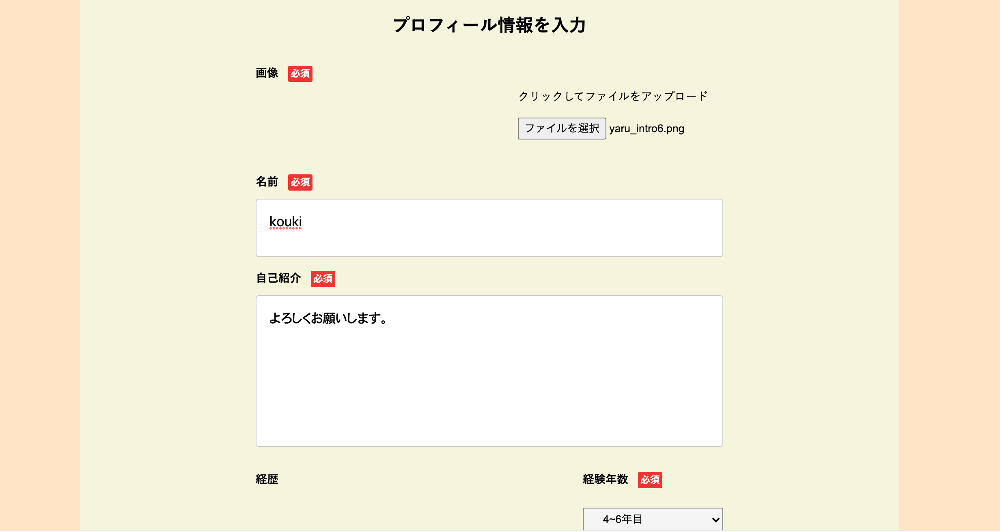
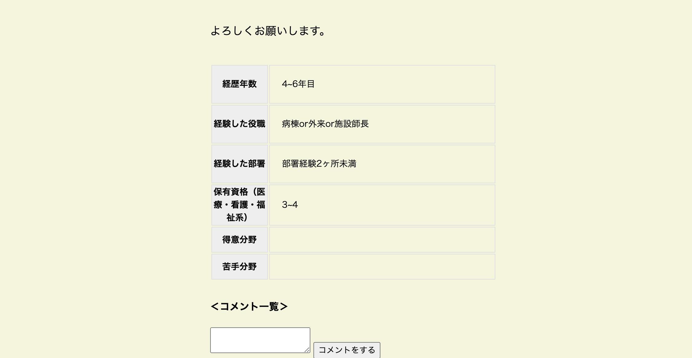
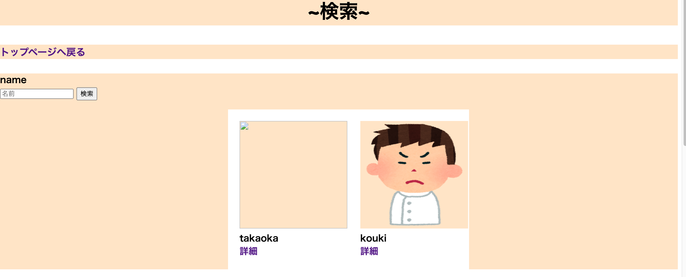

# DB設計

## usersテーブル

| Column             | Type       | Options                        |
| -------------------| ---------- | ------------------------------ |
| name               | string     | null: false                    |
| email              | string     | null: false, unique: true      |
| encrypted_password | string     | null: false                    |
| birthday_year      | date       | null: false                    |
| gender_id          | integer    | null: false                    |

### Association
has_one :profile
has_many :favorites

## profilesテーブル

| Column             | Type       | Options                        |
| -------------------| ---------- | ------------------------------ |
| name               | string     | null: false                    |
| position_id        | integer    | null: false                    |
| consept            | text       | null: false                    |
| depertment_id      | integer    | null: false                    |
| division_id        | integer    | null: false                    |
| license_id         | integer    | null: false                    |
| strength           | text       |                                |
| weakness           | text       |                                |
| user               | references | null: false, foreign_key: true |

### Association

belongs_to :user
has_many :favorites

## comments
| Column             | Type       | Options                        |
| -------------------| ---------- | ------------------------------ |
| text               | text       |                                |
| user               | references | null: false, foreign_key: true |
| profile            | references | null: false, foreign_key: true |

### Association

belongs_to: user
belongs_to: profile

# アプリケーション名. 
## yaru-ja-nai-37240. 

# 本番環境. 
### https://yaru-ja-nai-37240.herokuapp.com/. 
### email: citrus@icloud.com. 
### password: 123456a. 

# 作成背景. 
### 看護師として、どういった経歴を持った人物なのかを自分自身で客観視したいと考え、. 
### 転職において、自分が人事であれば、求める人間像が詳細に把握できればと考えました. 
### 自身のことを言語化することで、面接時にしっかりと言語化でき、発言できると考えました. 

# 開発環境
## フロントエンド
### HTML,CSS / JavaScript
## バックエンド
### Ruby / Ruby on Rails
## インフラ
### MySQL
## テストコード
### Rspec
## テキストエディタ
### Visual Studio Code
## タスク管理
### GitHubプロジェクトボード

## プロフィール作成画面

### ・プロフィール作成をクリックし. 　　
### ・写真、name、自己紹介、経験年数、経験した役職の有無、部署の経験数、保有資格数を入力する. 
### ・得意分野、苦手分野は任意入力。作成をクリックすると作成できる. 

## プロフィール詳細画面

### ・トップページのプロフィール一覧をクリックすると投稿したユーザーのプロフィール詳細画面を閲覧できる. 
### ・自身の詳細画面には編集・削除ボタンが搭載されている. 
### ・詳細画面下部にコメント機能がある. 

## 検索画面

### ・トップページ上部にプロフィール検索があり、クリックにて検索ページに遷移できる. 
### ・name入力にてプロフィールが検索でき、一覧が表示される. 
